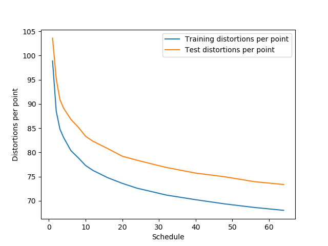

## Vector Quantization with KMeans Clustering

A vector quantizer with KMeans Clustering starting with one cluster and splitting the clusters with the highest distortions by following the defined schedule. 

The quantizer could be run by the following command:

		python	 vector-quantization.py --train <train-data-path> --test <test-data-path> --splittype <split-type> --output <output-file>

The arguments are optional. Their default values are as follows:
	
		--train: ./ProjectData/TrainData
		--test: ./ProjectData/TestData
		--load: False 
		--train-datapoints: train-datapoints.npy
		--test-datapoints: test-datapoints.npy 
		--splittype: binary-recursive // binary, binary-recursive or multiple
		--distance: l2 // l2 or l1
		--output: distortions.log

The plot showing distortions per point with respect to the given schedule:

